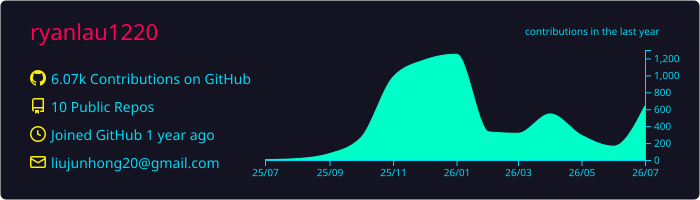
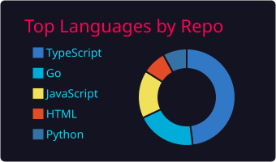
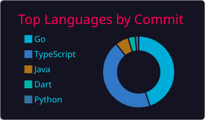
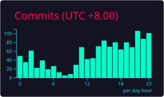

### 
<h2 align="center">👋 Hello! I'm Ryan.</h2>

<table width="100%" align="center">
  <tr>
    <td colspan="3" align="center"><a href="https://github.com/anuraghazra/github-readme-stats">
      <picture>
        <source
          srcset="https://github-readme-stats-fast.vercel.app/api?username=ryanlau1220&show_icons=true&hide_border=true&count_private=true&include_all_commits=true&number_format=long&bg_color=00000000&theme=dark&rank_icon=github"
          media="(prefers-color-scheme: dark)" />
        <source
          srcset="https://github-readme-stats-fast.vercel.app/api?username=ryanlau1220&show_icons=true&hide_border=true&count_private=true&include_all_commits=true&number_format=long&bg_color=00000000&rank_icon=github"
          media="(prefers-color-scheme: light), (prefers-color-scheme: no-preference)" />
        
      </picture>
    </a></td>
    <td colspan="3" align="center"><a href="https://github.com/denvercoder1/github-readme-streak-stats">
      <picture>
        <source
          srcset="https://streak-stats.demolab.com/?user=ryanlau1220&mode=weekly&hide_border=true&background=00000000&theme=dark"
          media="(prefers-color-scheme: dark)" />
        <source
          srcset="https://streak-stats.demolab.com/?user=ryanlau1220&mode=weekly&hide_border=true&background=00000000"
          media="(prefers-color-scheme: light), (prefers-color-scheme: no-preference)" />
        
      </picture>
    </a></td>
  </tr>
  <tr>
    <td colspan="6" align="center"></td>
  </tr>
  <tr>
    <td colspan="2" align="center"></td>
    <td colspan="2" align="center"></td>
    <td colspan="2" align="center"></td>
  </tr>
  <tr>
    <td colspan="6" align="center">
      <picture>
        <source media="(prefers-color-scheme: dark)" srcset="https://raw.githubusercontent.com/ryanlau1220/ryanlau1220/output/github-contribution-grid-snake-dark.svg" />
        <source media="(prefers-color-scheme: light)" srcset="https://raw.githubusercontent.com/ryanlau1220/ryanlau1220/output/github-contribution-grid-snake.svg" />
        
      </picture>
    </td>
  </tr>
</table>